<div align="center">


# Totalcad&#8209;ZWCAD

**Crie suas próprias rotinas LISP para o ZWCAD conversando em português.**<br>
Da tarefa que te faz perder tempo à rotina testada e pronta para distribuir — sem escrever
uma linha de código.

<br>

[](#instala%C3%A7%C3%A3o)
[](https://www.zwsoft.com/)
[](#o-que-ela-sabe-do-zwcad)
[](#o-processo)

<br>

<sub>Criada por **Alison Cruz** · mantida e distribuída pela **TotalCAD**</sub>

</div>

<br>

---

<br>

## O problema

Peça a uma IA genérica uma LISP para o ZWCAD. Ela responde rápido, o código sai bonito e
comentado — e não roda. Ou pior: roda, não reclama, e não faz nada.

**O que ela não tem é conhecimento do ZWCAD.**

Ela chuta. Chuta função que não existe, chuta identificador de objeto COM, chuta a ordem das opções
de um comando. Quando você pergunta como proteger o código, ela inventa um jeito. E quando você
pede algo que o ZWCAD já faz de fábrica, ela constrói de qualquer jeito — porque não sabe que já
existe.

> **A IA escreve. O conhecimento do ZWCAD é seu.**<br>
> Esta skill é esse conhecimento, escrito uma vez e aplicado sempre.

Ela chega com a documentação oficial da ZWSOFT embutida: **476 funções LISP**, uma por arquivo, para
consulta sob demanda. Já sabe o que não existe, já sabe qual recurso é nativo, já sabe que proteger
código é o comando `COMPILE`. Você descreve o problema, ela pergunta o que falta, e o que sai roda.

<br>

## O processo

Entra do jeito que você conseguir descrever. Sai testada, e do jeito que você escolher distribuir.

```mermaid
flowchart LR
    A["💬 só o problema<br><i>'perco 40 min por dia'</i>"] --> N
    B["💡 ideia pronta<br><i>'quero um botão que...'</i>"] --> N

    N{"🔍 já é nativo<br>no ZWCAD?"}
    N -- "sim" --> X["✋ ensina o comando<br>e não constrói nada"]
    N -- "não" --> D["❓ entrevista<br>2 a 8 perguntas"]

    D --> G{{"PREMISSAS<br>tabela fechada + ok<br>informado vs. assumido"}}
    G ==> H["🐞 versão DEBUG<br>narra tudo + log em TXT"]
    H --> T["🧪 APPLOAD e testar"]
    T -- "deu errado:<br>você manda o TXT" --> H
    T -- "você aprova" --> F["✅ versão final<br>debug desligado"]
    F --> P{"proteger o código?"}
    P -- "não" --> L[".lsp aberto<br>roda em qualquer CAD"]
    P -- "sim" --> Z["🔒 .zelx<br>só ZWCAD"]

    classDef entrada fill:#1c1c1c,stroke:#F1986C,stroke-width:1px,color:#e8e8e8
    classDef portao  fill:#F1986C,stroke:#F1986C,stroke-width:2px,color:#1c1c1c
    classDef saida   fill:#1c1c1c,stroke:#8a8a8a,stroke-width:1px,color:#e8e8e8
    classDef freio   fill:#1c1c1c,stroke:#315AE5,stroke-width:2px,color:#e8e8e8

    class A,B entrada
    class N,G,P portao
    class D,H,T,F,L,Z saida
    class X freio
```



**A regra-mãe:** não automatize o que já é nativo. Escrever uma LISP para o que o ZWCAD já faz custa
o seu tempo, mais um arquivo para manter, e quebra na próxima versão.

**A segunda regra:** ninguém acerta de primeira. Por isso **toda versão nasce em modo debug** — e só
você decide quando está pronta.

<br>

## Por que importa

<table>
<tr>
<td width="50%" valign="top">

### 🔍 Verifica o nativo antes de construir

Antes de qualquer entrevista, a skill checa **22 recursos nativos** do ZWCAD que costumam ser
reinventados como LISP sem necessidade.

Se já existe, ela **para e te ensina o comando** — em vez de gastar sua tarde construindo o que
veio de fábrica.

</td>
<td width="50%" valign="top">

### 🎯 Nada de premissa escondida

Antes de escrever código, uma tabela fechada separa **o que você informou** do **que ela arbitrou**.

Você vê de relance o que foi decidido nas suas costas e corrige **antes** de gastar tempo testando.

</td>
</tr>
<tr>
<td width="50%" valign="top">

### 📚 Consulta em vez de chutar

A documentação oficial da ZWSOFT vem embutida: **476 funções**, uma por arquivo, mais o guia de DCL.

Em dúvida, ela lê o arquivo da função. Ler um custa 6 KB — errar custa a sua tarde de teste.

</td>
<td width="50%" valign="top">

### 🐞 Toda versão nasce em modo debug

Ninguém acerta de primeira. Até **você** dizer que está perfeito, cada versão narra o que fez na
linha de comando e **grava um TXT**.

Deu errado? Você manda o arquivo inteiro de volta. Sem log, o que sobra é *"não funcionou"* — e a
correção vira chute.

</td>
</tr>
</table>

<br>

## Instalação

### 1. Tenha o ZWCAD

Funciona em **qualquer edição, Standard ou Professional** — LISP roda nas duas.

A skill também verifica se o que você pediu já é recurso nativo. Boa parte desses recursos nasceu no
**2026**, e alguns são exclusivos do **Professional** — quando for o seu caso, ela avisa que na sua
versão o recurso não existe e a rotina faz sentido.

### 2. Instale a skill

```bash
git clone https://github.com/inovacao-totalcad/Totalcad-ZWCAD.git
```

**Claude Code — todos os projetos:**

```bash
cp -r Totalcad-ZWCAD/skills/totalcad-lisp ~/.claude/skills/
```

**Claude Code — só neste projeto:**

```bash
cp -r Totalcad-ZWCAD/skills/totalcad-lisp .claude/skills/
```

<details>
<summary><b>Windows (PowerShell)</b></summary>

<br>

```powershell
Copy-Item -Recurse Totalcad-ZWCAD\skills\totalcad-lisp "$env:USERPROFILE\.claude\skills\"
```

</details>

<details>
<summary><b>Outro agente (Antigravity, Codex, OpenCode, Cursor)</b></summary>

<br>

Peça ao próprio agente:

```
instale esta skill que está na pasta Totalcad-ZWCAD/skills/totalcad-lisp
```

Ele sabe onde a pasta de skills dele fica.

</details>

### 3. Confirme que pegou

Pergunte ao seu agente:

```
como eu protejo uma LISP no ZWCAD?
```

Se ele citar o comando **`COMPILE`** e o formato **`.zelx`**, está instalada. Se inventar uma função
de compilação, não carregou.

### 4. Use

Diga o que te dá trabalho, em linguagem normal, sem tentar descrever a solução:

```
perco 40 minutos arrumando os layers de todo arquivo que recebo do cliente
```

<br>

## Como conversar com ela

| Você manda | Ela faz |
|---|---|
| Só a dor — *"perco tempo com X"* | Pergunta como você faz hoje, na mão, e propõe a solução |
| A ideia já pronta | Preenche só os buracos — 2 a 4 perguntas |
| Um pedido que já é nativo | **Para**, mostra o comando, e explica por que uma LISP seria pior |
| O TXT de log da versão debug | Diz **em qual etapa** parou, qual era a causa, e devolve o arquivo corrigido |
| *"mudei de ideia, quero também..."* | Sobe a versão e mantém o padrão |

**Ela nunca:** escreve código antes de fechar a entrevista · aplica default em silêncio · assina a
rotina com o nome dela · usa função que não existe no ZWCAD · entrega sem tratar ESC e seleção
vazia · **declara pronto no seu lugar** · criptografa sem te avisar que aquilo prende a rotina ao ZWCAD.

<br>

## O que sai pronto

Você não escreve nada. Responde perguntas e testa. O que sai segue um padrão fixo:

```
ArrumaLayer/
  Source/         LISP_ArrumaLayer.lsp   ← fonte, para editar depois
  Distribution/   ArrumaLayer.zelx       ← se você escolher criptografar

na pasta do seu desenho, durante os testes:
  LOG_AC_ARRUMALAYER.txt                 ← o que você manda de volta
```

| | |
|---|---|
| **Modo debug ligado** | Narra cada decisão e grava TXT — até você aprovar |
| **Comando com o seu prefixo** | `AC_`, `JM_`, o que você escolher — nunca o de outra pessoa |
| **Interface DCL** | Gerada dentro do próprio `.lsp` e apagada no fim. Sem `.dcl` solto |
| **Ajuda embutida** | No botão `[Ajuda]`, dentro do arquivo. Sem depender de internet |
| **Acesso duplo** | Botão na janela **e** comando direto, para quem tem pressa |
| **Trata ESC** | Restaura o que mexeu e não deixa o desenho sujo |
| **Ctrl+Z único** | Desfaz a execução inteira de uma vez |
| **Memória** | Lembra a última configuração usada, no registro |
| **Validação ao vivo** | Avisa do valor inválido na hora, não no OK |

<br>

## O que ela sabe do ZWCAD

**Proteger código é o comando `COMPILE`**, que gera `.zelx`. Não existe função LISP de compilação —
quem inventa uma, falha.

**Funções que não existem no ZWCAD** e derrubam a LISP:

| Função | O que fazer no lugar |
|---|---|
| `layerstate-getnames` | COM: `ZWCAD.ZcadLayerStateManager` |
| `ACET-*` (qualquer uma) | Escrever a lógica na mão |
| `vl-vlx-loaded-p` | Testar com `(if (null c:MEU_COMANDO) ...)` |
| `tablet` | Legado. Ignorar |

**E as que não aparecem em tabela nenhuma:**

> ⚠️ **`vlax-create-object` com o identificador errado devolve `nil` sem dar erro.** No ZWCAD é
> `ZWCAD.Application.<ano>`, `ZWCAD.ZcCmColor.<ano>` — com o ano da versão no fim. É a falha mais
> traiçoeira: a LISP roda, não reclama, e estoura longe da causa.

- **A janela DCL não abre?** Faltam `base.dcl` e `primitives.dcl` no caminho de suporte
- **`ZWCAD variable setting rejected`?** É `setvar` com valor fora de faixa ou variável inexistente
- **Carregar módulo binário** é `zrxload`, e o arquivo é `.zrx`
- **Arquivos de recurso** são `ZWCAD.lin`, `ZWCAD.pat`, `ZWCAD.cuix`

<br>

## Distribuição

Terminou e aprovou. Agora vem **a única escolha que a skill não faz por você:**

| Formato | Quem consegue abrir | Código visível? |
|---|---|---|
| **`.lsp`** como está | **Qualquer CAD que rode LISP** | Sim — quem receber lê e altera |
| **`.lsp` criptografado** | ⚠️ **Só ZWCAD** | Não |
| **`.zelx`** | ⚠️ **Só ZWCAD** | Não |

> ### Criptografar troca alcance por proteção.
> No momento em que você criptografa, a rotina **passa a ser exclusiva do ZWCAD** — não abre em
> nenhum outro CAD. Se deixar em `.lsp`, roda em qualquer lugar, mas o código vai aberto.

**Como decidir:**

| Sua situação | Escolha |
|---|---|
| Vai vender a rotina | **Criptografado** — seu público já é de ZWCAD |
| Uso interno, equipe toda em ZWCAD | **Criptografado**, e guarde o fonte |
| Compartilhar em grupo, fórum, com colega | **`.lsp` aberto** — não trave quem quer te ajudar |
| Está na dúvida | **`.lsp` aberto.** Criptografar depois é fácil; voltar atrás não existe |

<details>
<summary><b>Se você escolher criptografar</b></summary>

<br>

```
1. No ZWCAD, digite COMPILE
2. "Select File"           → o .lsp
3. "Select Save Directory" → onde salvar
4. Formato: .zelx
5. "Compile"
```

> ⚠️ **É via de mão única.** Não existe caminho de volta do `.zelx` para o fonte. **Guarde a pasta
> `Source/`** — se perder o `.lsp`, a rotina morre como está: sem correção, sem melhoria, sem
> religar o debug.

</details>

<br>

## Créditos

<table>
<tr>
<td valign="middle" width="120" align="center">

</td>
<td valign="middle">

**TotalCAD** — detentora e distribuidora oficial deste repositório.<br>
Revenda autorizada ZWCAD no Brasil.

</td>
<td valign="middle" width="150" align="center">
<picture>
  <source media="(prefers-color-scheme: dark)" srcset="assets/zwcad-white.png">
  
</picture>
</td>
</tr>
</table>

**Criação e autoria técnica:** [Alison Cruz](https://github.com/ba-lison) — concepção do workflow,
protocolo de entrevista, padrão de código LISP/DCL e curadoria da documentação técnica.

Desenvolvida a partir do curso **Destravando o Poder da IA no CAD 2D**.

<br>

## Aviso

ZWCAD e ZWSOFT são marcas da **ZWSOFT Co., Ltd. (Guangzhou)**. Claude e Claude Code são marcas da
**Anthropic**. Este projeto não é afiliado nem endossado por elas — é uma skill independente.

A documentação em `skills/totalcad-lisp/docs/` é material público da ZWSOFT, convertido para
consulta offline.

O código gerado por esta skill **é de responsabilidade de quem o publica**. Teste antes de
distribuir: caminho normal, ESC no meio, seleção vazia e Ctrl+Z.

<br>

---

<div align="center">


**TotalCAD** · [hub.totalcad.com.br](https://hub.totalcad.com.br)

<sub>Feito para quem entrega projeto.</sub>

</div>
