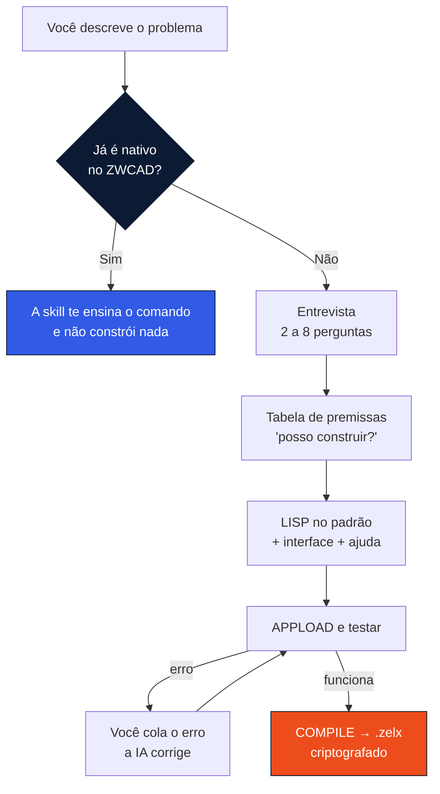

<div align="center">

<picture>
  <source media="(prefers-color-scheme: dark)" srcset="assets/totalcad-branco.png">
  
</picture>

<br><br>

<picture>
  <source media="(prefers-color-scheme: dark)" srcset="assets/zwcad-branco.png">
  
</picture>

<br><br>

# Fábrica de LISP para ZWCAD

**Descreva o problema. A IA entrevista, escreve o plugin e criptografa para você distribuir.**

Uma skill de IA que conhece o ZWCAD de verdade — as funções que existem,<br>os recursos que já vêm de
fábrica, e o comando que protege o seu código.

<br>


</div>

<br>

## O problema

Uma IA genérica escreve LISP que **parece** certo. Você carrega no ZWCAD e ele não roda — ou pior,
roda, não reclama, e não faz nada.

Porque ela chuta. Chuta função que não existe, chuta identificador de objeto COM, chuta a ordem das
opções de um comando. E quando você pergunta como proteger o código, ela inventa.

Esta skill não chuta: ela carrega a **documentação oficial da ZWSOFT** e consulta antes de escrever.

<br>

## Instalar

```bash
git clone https://github.com/inovacao-totalcad/Totalcad-ZWCAD.git ~/.claude/skills/totalcad-lisp
```

Usa outro agente? Peça a ele: *"instale esta skill que está na pasta Totalcad-ZWCAD"*.
Antigravity, Codex, OpenCode e Cursor sabem onde colocar.

### Testar se pegou

Pergunte ao seu agente: **"como eu protejo uma LISP no ZWCAD?"**

| Resposta | Significa |
|---|---|
| Cita o comando **`COMPILE`** e o formato **`.zelx`** | ✅ Instalada |
| Inventa uma função de compilação, ou não sabe | ❌ Não carregou |

<br>

## Como funciona



O passo que economiza mais tempo é o **segundo**. Antes de construir qualquer coisa, a skill
verifica se o ZWCAD já resolve — porque o erro mais caro em automação de CAD é escrever um plugin
para algo que já vem de fábrica.

> Um plugin comercial de tabela de coordenadas UTM, com contrato e manual, foi tornado desnecessário
> pelo **Coordinate Extraction** do ZWCAD 2027. O plugin não era ruim. Só deixou de ser preciso.

<br>

## O que você não escreve

Nada. Você responde perguntas e testa o resultado.

O que sai pronto, seguindo um padrão fixo:

- **Comando com o seu prefixo** — `AC_`, `JM_`, o que você escolher
- **Interface DCL** gerada dentro do próprio LISP, sem arquivo solto
- **Ajuda embutida** no botão `[Ajuda]`, sem depender de internet
- **Acesso duplo** — botão na janela e comando direto para quem tem pressa
- **Tratamento de ESC** que não deixa o desenho sujo
- **Ctrl+Z único** desfaz a execução inteira
- **Memória** da última configuração usada
- **`.zelx` criptografado** para você compartilhar sem entregar o código

<br>

## O que tem dentro

| | |
|---|---|
| **`SKILL.md`** | O fluxo de 7 passos. É o que o agente lê primeiro |
| **`references/ENTREVISTA.md`** | Dois caminhos de entrada e as 8 perguntas que definem um plugin |
| **`references/NATIVO-PRIMEIRO.md`** | 22 pedidos comuns que o ZWCAD já resolve — e desde qual versão |
| **`references/ARMADILHAS-ZWCAD.md`** | Onde a IA erra: funções inexistentes, identificadores COM, DCL que não abre |
| **`references/PADRAO-CODIGO.md`** | O esqueleto LISP + DCL, com os erros clássicos já corrigidos |
| **`docs/LISP_Reference/`** | 476 arquivos, um por função — consulta sob demanda |
| **`docs/LISP_Migration/`** | Notas oficiais da ZWSOFT: identificadores COM, arquivos de recurso, FAQ de erros |
| **`docs/DCL/`** | Dois guias de DCL avançado, em português |

<br>

## Uma amostra do que ela sabe

**Proteger código é o comando `COMPILE`**, que gera `.zelx`. Não existe função LISP de compilação —
quem inventa uma, falha.

**Funções que não existem no ZWCAD** e derrubam o plugin:

| Função | O que fazer no lugar |
|---|---|
| `layerstate-getnames` | COM: `ZWCAD.ZcadLayerStateManager` |
| `ACET-*` (qualquer uma) | Escrever a lógica na mão |
| `vl-vlx-loaded-p` | Testar com `(if (null c:MEU_COMANDO) ...)` |
| `tablet` | Legado. Ignorar |

**E as que não aparecem em tabela nenhuma:**

- **`vlax-create-object` com o identificador errado devolve `nil` sem dar erro.** No ZWCAD é
  `ZWCAD.Application.<ano>`, `ZWCAD.ZcCmColor.<ano>`. Falha silenciosa, que estoura longe da causa
- **A janela DCL não abre?** Faltam `base.dcl` e `primitives.dcl` no caminho de suporte
- **`ZWCAD variable setting rejected`?** É `setvar` com valor fora de faixa ou variável inexistente

<br>

## Requisitos

| | |
|---|---|
| **ZWCAD** | 2026 ou 2027 · o trial de 30 dias serve |
| **Um agente de IA** | Claude Code, Antigravity, Codex, OpenCode ou Cursor |
| **Saber programar** | Não |

<br>

## Curso

Esta skill é o material central da **Aula 2** do curso *Destravando o Poder da IA no CAD 2D*,
ministrado por **Alison Cruz** — 6 horas ao vivo, com mentoria.

<a href="https://loja.ebbim.com.br">loja.ebbim.com.br</a>

<br>

---

<div align="center">


**Criação:** Alison Cruz · **Desenvolvimento:** TotalCAD
<br>
<sub>Revenda autorizada ZWCAD no Brasil</sub>

<br>

<sub>A documentação em <code>docs/</code> é material público da ZWSOFT Co., Ltd.,
convertido para consulta offline.<br>
ZWCAD é marca registrada da ZWSOFT.</sub>

</div>
